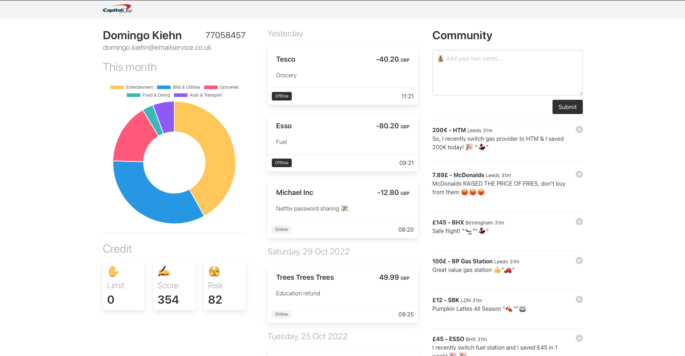

# CommonCents
[🔗 Official website](https://hackthemidlands.com)

This repository contains the hacked-together MVP of the CommonCents app for our attempt at tackling the challenge posed by hackathon sponsors - Capital One.

Our misssion - which we've chosen to accept - is to develop a product that changes banking for good.

## UPDATE
We won!!! The folks from Capital One liked our idea and execution, so, they named us as winners of their challenge 🎉

## Our team
Although this hackathon is a first for many of us, and almost all of us are relatively new to programming, we know we'll give all the others a run for their money, and we'll have fun doing it too!

We're a mix of students, some at Uni, others on a bootcamp, but we're all passionate about software, and its capacity for positive change.

Our team members (in no particular order are):
- Chioma
- [Vlad](https://github.com/noonereedus)
- Micheal
- Omid
- Ahmed
- Sina
- Salamat
- Aaron
- Marcia

### Communicate your spendings. Control your spendings. Listen to the CommonCents

## Our idea
Special thanks to Ahmed & Michael for spawning the idea that we've gone on to evolve. In short...

> We aim to tackle the UK's current cost-of-living crisis but giving people more agency over their spending, by helping them to make better choices.

There are three parts to our strategy
1. Visibility
2. Community
3. Vitality

### Visibility
The first step to solving a problem is recognising it.

We believe banks and other financial institutions can do more to communicate customer spending habits in easily digestible ways.

To demonstrate this, we'll attempt to present some customer spending data in a visually engaging and aesthetically pleasing manner.

### Community
Nothing beats the power of community!

Making a change to any habit can be difficult. However, it's no secret that with the support and learnings from those around us, we often stand a better chance.

The core of our idea here is to foster communities of people helping each other to make better financial decision, by showing and by telling.

Say a someone living in my area with a similar monthly income is paying 20% more on utlities than I am, I should be able to help them out by suggesting they switch to my energy provider or adopt my usuage patterns.

I can do this all without revealing who I am or knowing who they are. Perhaps more importantly, they can trust my advice since I can share a verifed receipt of my utilties spending with leaking any sensitive information.

### Vitality
It's important to stay energised and engaged when it comes to finance.

For many people, their experience of finance is confined to simple deposits and withdrawals. Sadly, discussions around asset management (investing) and fraud prevention often go unheld.

We want to change this.

Through the community and possibly AI-powered finance educators, we aim to get more people exploring their options through sensible investments as an alternative to devaluation of their assets due to inflation. We'll also facilitate conversations helping to prevent common fradulent attacks.

### Our tech stack
As mentioned earlier, some of the team are Uni students and fell most comfortable with Python, whereas the other half are self-taugh/bootcamp students with more HTML, CSS & JS experience.

Naturally, we've structured our stack to play to everyone's strengths, and as such will be building our MVP as a Python Flask server

- Python for the Model & Contoller
- Jinja 2 Embedded HTML & JS for the View
- Bulma for our Style

